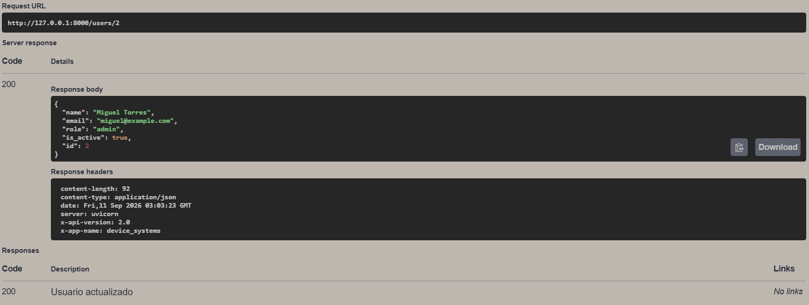
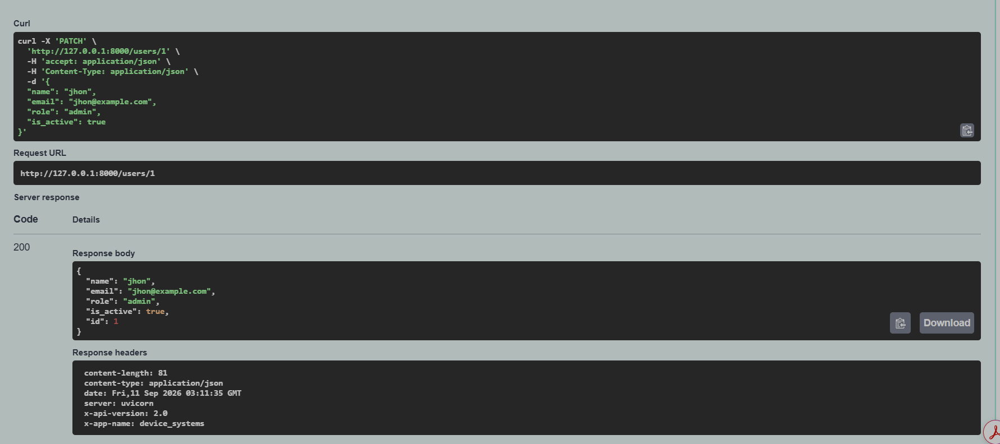
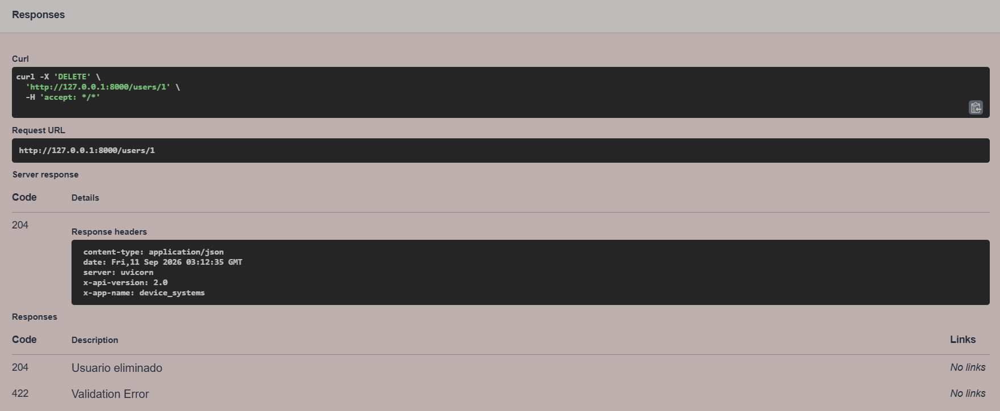
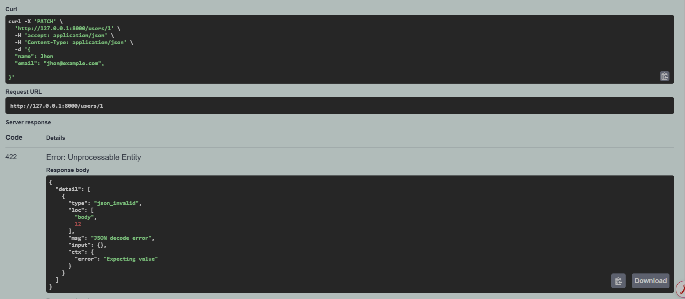
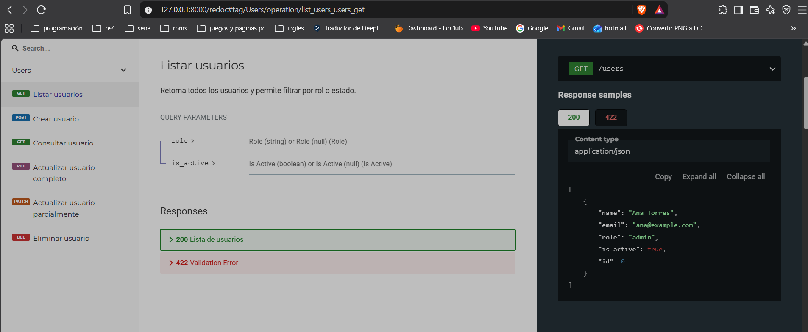

# device_systems

API REST construida con FastAPI y Pydantic para administrar usuarios mediante
un CRUD completo. Permite crear, consultar, filtrar, actualizar y eliminar
usuarios, con validaciones, manejo de errores y Dependency Injection.

> Los usuarios se almacenan en memoria y se eliminan cuando se reinicia el servidor.

## Instalacion

Requiere Python 3.11 o superior y [uv](https://docs.astral.sh/uv/).

```powershell
uv sync
```

## Ejecucion

```powershell
uv run uvicorn device_systems.main:app --reload
```

La API queda disponible en `http://127.0.0.1:8000` y Swagger UI en
`http://127.0.0.1:8000/docs`. La documentacion ReDoc esta disponible en
`http://127.0.0.1:8000/redoc`.

## Tecnologias

- Python 3.11
- FastAPI
- Pydantic 2
- Uvicorn

## Endpoints

| Metodo | Endpoint | Descripcion |
|---|---|---|
| GET | `/users` | Lista todos los usuarios |
| GET | `/users/{user_id}` | Consulta un usuario por ID |
| GET | `/users?role=admin` | Filtra usuarios por rol |
| GET | `/users?is_active=true` | Filtra usuarios por estado |
| POST | `/users` | Registra un usuario |
| PUT | `/users/{user_id}` | Reemplaza todos los datos de un usuario |
| PATCH | `/users/{user_id}` | Modifica algunos datos de un usuario |
| DELETE | `/users/{user_id}` | Elimina un usuario |

Los filtros `role` e `is_active` pueden combinarse. Los roles permitidos son
`admin`, `support` y `user`.

## Ejemplos de peticiones

Crear un usuario:

```http
POST /users HTTP/1.1
Host: 127.0.0.1:8000
Content-Type: application/json

{
  "name": "Ana Torres",
  "email": "ana@example.com",
  "role": "admin",
  "is_active": true
}
```

Respuesta esperada (`201 Created`):

```json
{
  "id": 1,
  "name": "Ana Torres",
  "email": "ana@example.com",
  "role": "admin",
  "is_active": true
}
```

Consultas GET:

```http
GET /users HTTP/1.1
Host: 127.0.0.1:8000
```

```http
GET /users/1 HTTP/1.1
Host: 127.0.0.1:8000
```

```http
GET /users?role=admin&is_active=true HTTP/1.1
Host: 127.0.0.1:8000
```

Si el ID no existe se retorna `404`; un correo repetido retorna `400`; y los
datos que no cumplen el esquema retornan `422`.

Actualizar completamente un usuario:

```http
PUT /users/1 HTTP/1.1
Content-Type: application/json

{
  "name": "Ana Martinez",
  "email": "ana@example.com",
  "role": "support",
  "is_active": true
}
```

Actualizar solamente el rol:

```http
PATCH /users/1 HTTP/1.1
Content-Type: application/json

{
  "role": "user"
}
```

Eliminar un usuario:

```http
DELETE /users/1 HTTP/1.1
```

## Codigos de estado

| Codigo | Significado |
|---|---|
| 200 | Consulta o actualizacion exitosa |
| 201 | Usuario creado |
| 204 | Usuario eliminado sin contenido de respuesta |
| 400 | Correo duplicado o PATCH sin campos |
| 404 | Usuario no encontrado |
| 422 | Datos enviados no validos |

## Dependency Injection y manejo de errores

La funcion `get_user_or_404` busca el usuario solicitado. Las rutas GET por ID,
PUT, PATCH y DELETE la reutilizan mediante `Depends()`. Si el usuario no existe,
la dependencia genera una excepcion HTTP con codigo 404.

La dependencia `get_email_validator` reutiliza una sola funcion para comprobar
que el correo no pertenezca a otro usuario antes de ejecutar POST, PUT y PATCH.

Los correos duplicados y las actualizaciones vacias se controlan con
`HTTPException`. Pydantic valida automaticamente el nombre, correo, rol y estado.

## Pruebas manuales

1. Inicie el servidor y abra Swagger UI en `http://127.0.0.1:8000/docs`.
2. Pruebe `POST /users` y luego los endpoints GET con **Try it out**.
3. Pruebe tambien los endpoints PUT, PATCH y DELETE.
4. Verifique los errores 400, 404 y 422 descritos anteriormente.
5. En Postman o Thunder Client, cree una coleccion con la URL base
   `http://127.0.0.1:8000` y replique las peticiones anteriores.
6. Compruebe las cabeceras `X-App-Name` y `X-API-Version`.

## Capturas de Swagger UI

### Endpoints disponibles


### Peticion GET de usuarios


### Peticion POST para crear un usuario


### Peticion GET de usuario por ID


### Peticion PUT de usuario por ID



### Peticion PATCH de usuario por ID



### Peticion DELETE de usuario por ID



### Prueba de error controlado



## Capturas de ReDoc

