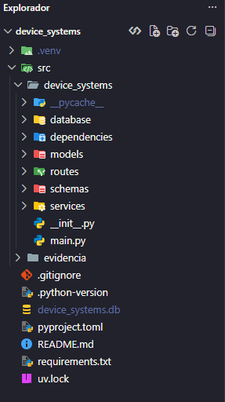
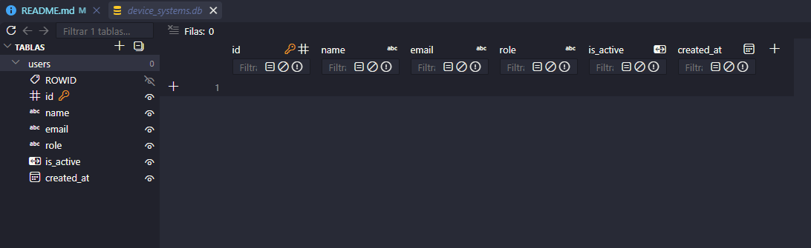
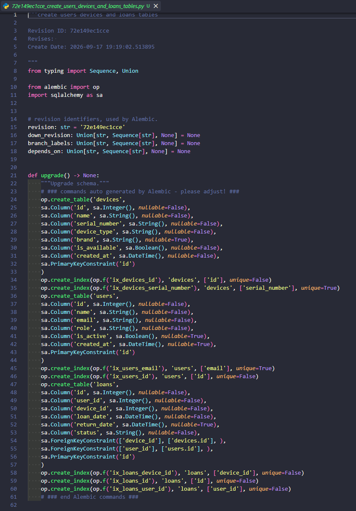
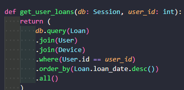
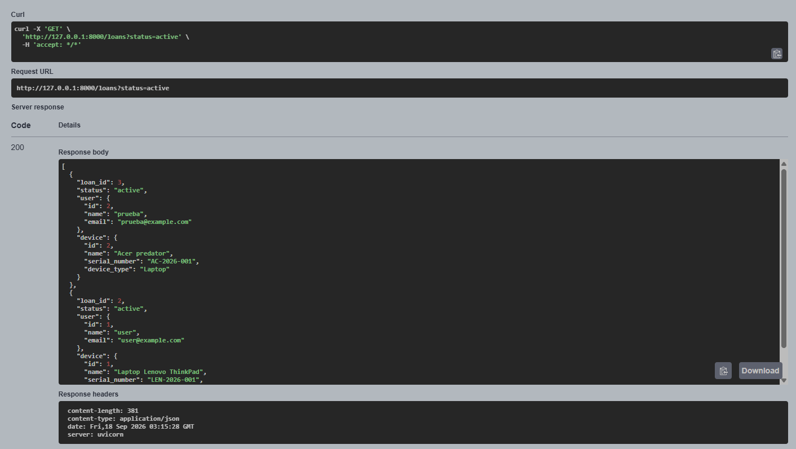
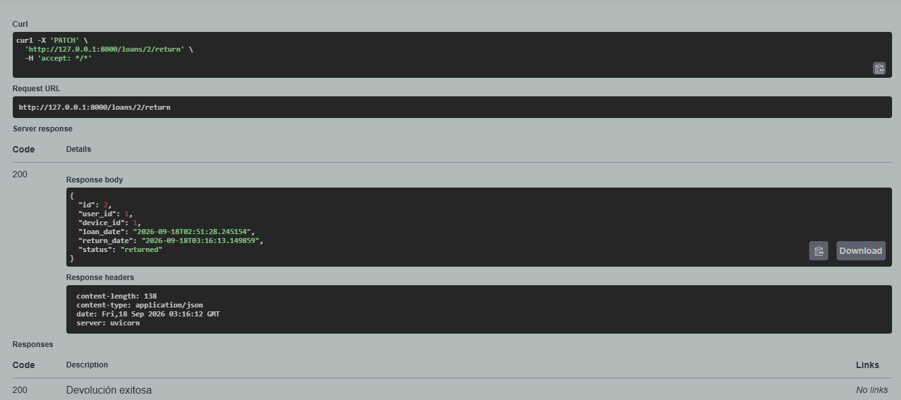

# device_systems

API REST construida con FastAPI, SQLAlchemy, Alembic y Pydantic para administrar
usuarios, dispositivos y prestamos. Los cambios de la base SQLite se controlan
mediante migraciones.

> La estructura de la base de datos se crea con `alembic upgrade head`.

## Instalacion

Requiere Python 3.11 o superior y [uv](https://docs.astral.sh/uv/).

```powershell
uv sync
```

## Ejecucion

```powershell
uv run alembic upgrade head
uv run alembic current
uv run alembic history
```

```powershell
uv run uvicorn device_systems.main:app --reload
```

La API queda disponible en `http://127.0.0.1:8000` y Swagger UI en
`http://127.0.0.1:8000/docs`. La documentacion ReDoc esta disponible en
`http://127.0.0.1:8000/redoc`.

## Tecnologias

- Python 3.11
- FastAPI
- SQLAlchemy
- Alembic
- SQLite
- Pydantic 2
- Uvicorn

## Endpoints

| Metodo | Endpoint | Descripcion |
|---|---|---|
| GET | `/users` | Lista todos los usuarios |
| GET | `/users/{user_id}` | Consulta un usuario por ID |
| GET | `/users?role=admin` | Filtra usuarios por rol |
| GET | `/users?is_active=true` | Filtra usuarios por estado |
| GET | `/users?order_by=created_at` | Ordena por fecha de creacion |
| POST | `/users` | Registra un usuario |
| PUT | `/users/{user_id}` | Reemplaza todos los datos de un usuario |
| PATCH | `/users/{user_id}` | Modifica algunos datos de un usuario |
| DELETE | `/users/{user_id}` | Elimina un usuario |
| GET | `/devices` | Lista y filtra dispositivos |
| GET | `/devices/{device_id}` | Consulta un dispositivo |
| POST | `/devices` | Registra un dispositivo |
| PUT | `/devices/{device_id}` | Actualiza completamente un dispositivo |
| PATCH | `/devices/{device_id}` | Actualiza parcialmente un dispositivo |
| DELETE | `/devices/{device_id}` | Elimina un dispositivo sin prestamos |
| GET | `/loans` | Lista prestamos con joins y filtros |
| GET | `/loans/details` | Muestra informacion relacionada |
| GET | `/loans/{loan_id}` | Consulta un prestamo |
| POST | `/loans` | Registra un prestamo |
| PATCH | `/loans/{loan_id}/return` | Devuelve un dispositivo |
| GET | `/users/{user_id}/loans` | Prestamos de un usuario |
| GET | `/devices/{device_id}/loans` | Historial de un dispositivo |

Los filtros `role` e `is_active` pueden combinarse. Los roles permitidos son
`admin`, `support` y `user`.

## Ejemplos de peticiones

Crear un usuario:

```http
POST /users HTTP/1.1
Host: 127.0.0.1:8000
Content-Type: application/json

{
  "name": "Ana Torres",
  "email": "ana@example.com",
  "role": "admin",
  "is_active": true
}
```

Respuesta esperada (`201 Created`):

```json
{
  "id": 1,
  "name": "Ana Torres",
  "email": "ana@example.com",
  "role": "admin",
  "is_active": true,
  "created_at": "2026-09-17T10:00:00"
}
```

Consultas GET:

```http
GET /users HTTP/1.1
Host: 127.0.0.1:8000
```

```http
GET /users/1 HTTP/1.1
Host: 127.0.0.1:8000
```

```http
GET /users?role=admin&is_active=true HTTP/1.1
Host: 127.0.0.1:8000
```

Si el ID no existe se retorna `404`; un correo repetido retorna `400`; y los
datos que no cumplen el esquema retornan `422`.

Actualizar completamente un usuario:

```http
PUT /users/1 HTTP/1.1
Content-Type: application/json

{
  "name": "Ana Martinez",
  "email": "ana@example.com",
  "role": "support",
  "is_active": true
}
```

Actualizar solamente el rol:

```http
PATCH /users/1 HTTP/1.1
Content-Type: application/json

{
  "role": "user"
}
```

Eliminar un usuario:

```http
DELETE /users/1 HTTP/1.1
```

Crear un dispositivo:

```json
{
  "name": "Laptop Lenovo ThinkPad",
  "serial_number": "LEN-2026-001",
  "device_type": "laptop",
  "brand": "Lenovo",
  "is_available": true
}
```

Crear un prestamo:

```json
{
  "user_id": 1,
  "device_id": 1
}
```

Consultas relacionadas y filtros:

```http
GET /devices?device_type=laptop&is_available=true&brand=lenovo&search=thinkpad
GET /loans?status=active&user_email=ana@sena.edu.co&device_type=laptop
GET /users/1/loans
GET /devices/1/loans
```

## Codigos de estado

| Codigo | Significado |
|---|---|
| 200 | Consulta o actualizacion exitosa |
| 201 | Usuario creado |
| 204 | Usuario eliminado sin contenido de respuesta |
| 400 | Correo duplicado o PATCH sin campos |
| 404 | Usuario no encontrado |
| 409 | Dispositivo no disponible o prestamo ya devuelto |
| 422 | Datos enviados no validos |

## Migraciones con Alembic

Alembic usa `Base.metadata` y carga los modelos `User`, `Device` y `Loan` desde
`alembic/env.py`. La migracion inicial crea las tres tablas, indices, claves
foraneas y restricciones.

```powershell
uv run alembic revision --autogenerate -m "descripcion del cambio"
uv run alembic upgrade head
uv run alembic history
```

Las migraciones generadas deben revisarse antes de aplicarse y no deben editarse
despues de haber sido compartidas o aplicadas en otros entornos.

## Relaciones y consultas con joins

- Un usuario puede tener muchos prestamos.
- Un dispositivo puede aparecer en muchos prestamos historicos.
- Cada prestamo pertenece a un usuario y a un dispositivo.

Las relaciones se implementan con `ForeignKey`, `relationship` y
`back_populates`. Las consultas usan `join()`, `and_()`, `or_()` e `ilike()` para
combinar las tablas y aplicar filtros opcionales.

## Persistencia, Dependency Injection y manejo de errores

El modelo SQLAlchemy `User` representa la tabla `users`. El servicio realiza las
consultas y operaciones CRUD usando la sesion de SQLAlchemy.

La dependencia `get_db` abre una sesion para cada peticion mediante `Depends()`
y garantiza que se cierre al finalizar la operacion.

La dependencia `get_user_or_404` busca el usuario solicitado para GET, PUT,
PATCH y DELETE. La dependencia `get_email_validator` reutiliza la validacion de
correo duplicado en POST, PUT y PATCH. FastAPI comparte la misma sesion dentro
de cada peticion.

Las dependencias `get_device_or_404` y `get_loan_or_404` aplican el mismo patron
para dispositivos y prestamos, evitando repetir las consultas y respuestas 404.

Los usuarios inexistentes, correos duplicados y PATCH vacios se controlan con
`HTTPException`. Pydantic valida el nombre, correo, rol y estado antes de acceder
a la base de datos.

## Pruebas manuales

1. Aplique las migraciones e inicie el servidor.
2. Cree un usuario y un dispositivo desde Swagger UI.
3. Cree un prestamo y confirme que el dispositivo no quede disponible.
4. Pruebe los filtros y consultas con joins.
5. Devuelva el dispositivo y confirme que vuelva a estar disponible.
6. Verifique los errores 400, 404, 409 y 422.
7. En Postman o Thunder Client, cree una coleccion con la URL base
   `http://127.0.0.1:8000` y replique las peticiones anteriores.

## Reflexion

Alembic permite evolucionar la base de datos de forma controlada y reproducible.
Las relaciones garantizan que cada prestamo tenga un usuario y un dispositivo,
mientras que los joins permiten consultar informacion completa sin duplicar los
datos entre tablas.

## Estructura del proyecto


## Base de datos


## Capturas de Swagger UI

### Endpoints disponibles


### Peticion GET de usuarios


### Peticion POST para crear un usuario


### Peticion GET de usuario por ID


### Peticion PUT de usuario por ID


### Peticion PATCH de usuario por ID


### Peticion DELETE de usuario por ID


### Prueba de error controlado


## Capturas de ReDoc


## Evidencias de la actividad EV10

### Inicializacion de Alembic

La captura evidencia la ejecucion de `uv run alembic init alembic` y la
creacion de los archivos necesarios para administrar migraciones.


### Creacion de la migracion

Generacion automatica de la migracion para las tablas `users`, `devices` y
`loans` mediante `alembic revision --autogenerate`.


### Aplicacion de la migracion

Aplicacion de la revision mas reciente sobre SQLite mediante
`alembic upgrade head`.


### Estructura de tablas generadas

Estructura relacional formada por usuarios, dispositivos y prestamos, incluyendo
las claves foraneas que relacionan los prestamos con las otras dos tablas.



### Swagger UI

Documentacion automatica organizada mediante los tags Users, Devices y Loans.


### Creacion de usuario

Evidencia del registro de un usuario que posteriormente puede recibir un
dispositivo en prestamo.


### Creacion de dispositivo

Evidencia del registro de un dispositivo disponible y con numero de serie unico.


### Creacion de prestamo

El prestamo relaciona el usuario y el dispositivo existentes. Al crearlo, el
dispositivo cambia su disponibilidad a `false`.


### Consulta con joins

La respuesta combina los datos basicos del prestamo, usuario y dispositivo a
partir de las relaciones entre las tres tablas.



### Filtros aplicados

Evidencia de las consultas que permiten filtrar dispositivos o prestamos usando
parametros opcionales.



### Devolucion del dispositivo

La devolucion cambia el estado del prestamo a `returned`, asigna la fecha de
devolucion y vuelve a marcar el dispositivo como disponible.


