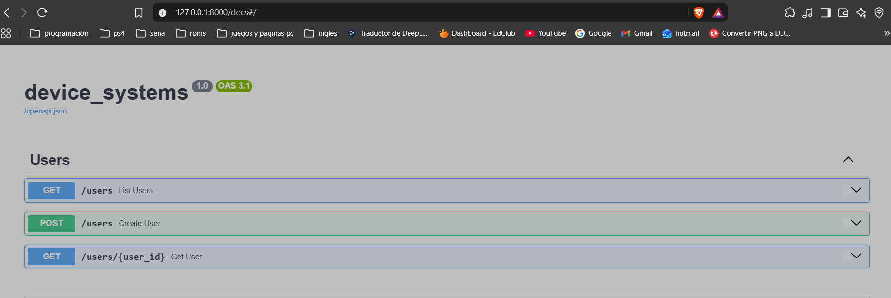
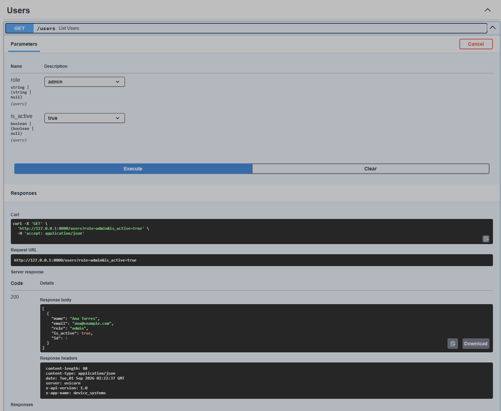
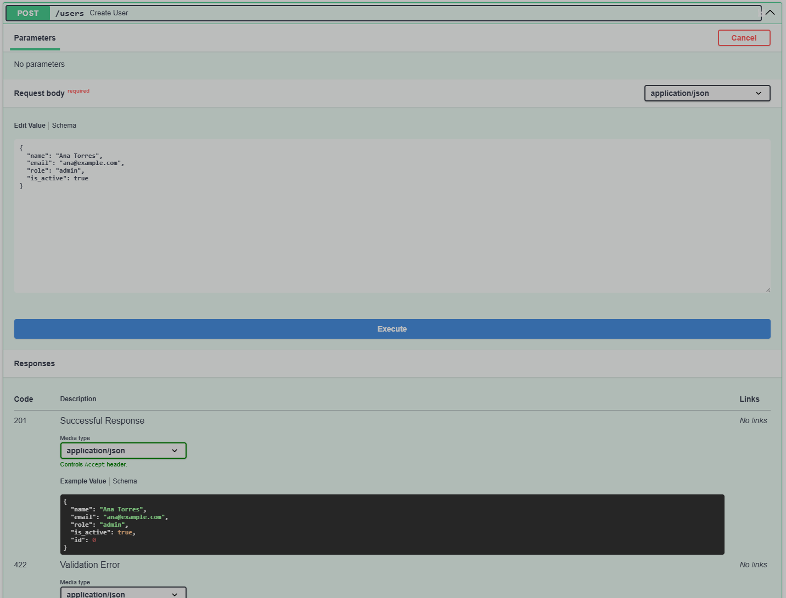
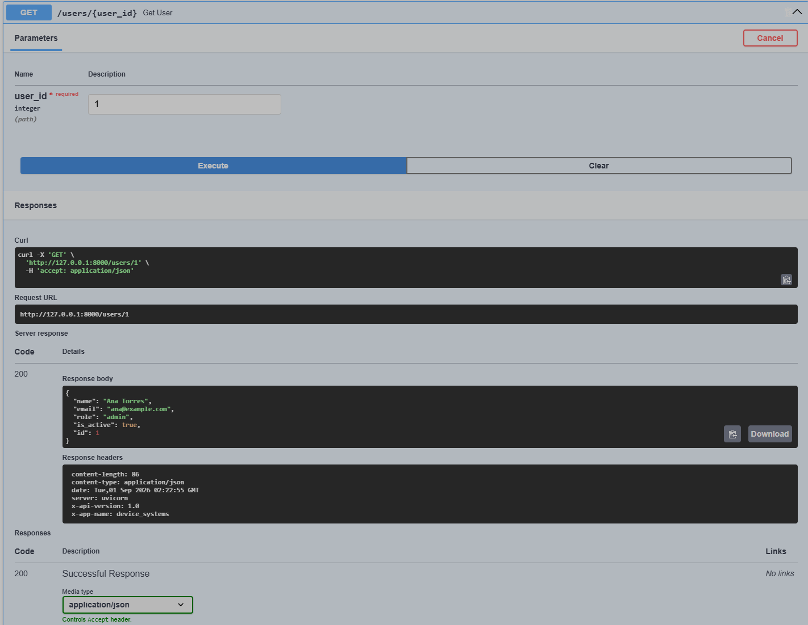

# device_systems

API REST construida con FastAPI y Pydantic para registrar, consultar y filtrar
usuarios. Incluye validacion de nombre, correo, rol y estado, evita correos
duplicados y agrega las cabeceras `X-App-Name: device_systems` y
`X-API-Version: 1.0` a las respuestas de usuarios.

> Los usuarios se almacenan en memoria y se eliminan cuando se reinicia el servidor.

## Instalacion

Requiere Python 3.11 o superior y [uv](https://docs.astral.sh/uv/).

```powershell
uv sync
```

## Ejecucion

```powershell
uv run uvicorn device_systems.main:app --reload
```

La API queda disponible en `http://127.0.0.1:8000` y Swagger UI en
`http://127.0.0.1:8000/docs`.

## Endpoints

| Metodo | Endpoint | Descripcion |
|---|---|---|
| GET | `/users` | Lista todos los usuarios |
| GET | `/users/{user_id}` | Consulta un usuario por ID |
| GET | `/users?role=admin` | Filtra usuarios por rol |
| GET | `/users?is_active=true` | Filtra usuarios por estado |
| POST | `/users` | Registra un usuario |

Los filtros `role` e `is_active` pueden combinarse. Los roles permitidos son
`admin`, `support` y `user`.

## Ejemplos de peticiones

Crear un usuario:

```http
POST /users HTTP/1.1
Host: 127.0.0.1:8000
Content-Type: application/json

{
  "name": "Ana Torres",
  "email": "ana@example.com",
  "role": "admin",
  "is_active": true
}
```

Respuesta esperada (`201 Created`):

```json
{
  "id": 1,
  "name": "Ana Torres",
  "email": "ana@example.com",
  "role": "admin",
  "is_active": true
}
```

Consultas GET:

```http
GET /users HTTP/1.1
Host: 127.0.0.1:8000
```

```http
GET /users/1 HTTP/1.1
Host: 127.0.0.1:8000
```

```http
GET /users?role=admin&is_active=true HTTP/1.1
Host: 127.0.0.1:8000
```

Si el ID no existe se retorna `404`; un correo repetido retorna `409`; y los
datos que no cumplen el esquema retornan `422`.

## Pruebas manuales

1. Inicie el servidor y abra Swagger UI en `http://127.0.0.1:8000/docs`.
2. Pruebe `POST /users` y luego los endpoints GET con **Try it out**.
3. En Postman o Thunder Client, cree una coleccion con la URL base
   `http://127.0.0.1:8000` y replique las peticiones anteriores.
4. Compruebe en la respuesta las cabeceras `X-App-Name` y `X-API-Version`.

## Capturas de Swagger UI

### Endpoints disponibles



### Peticion GET de usuarios



### Peticion POST para crear un usuario



### Peticion GET de usuario por ID


